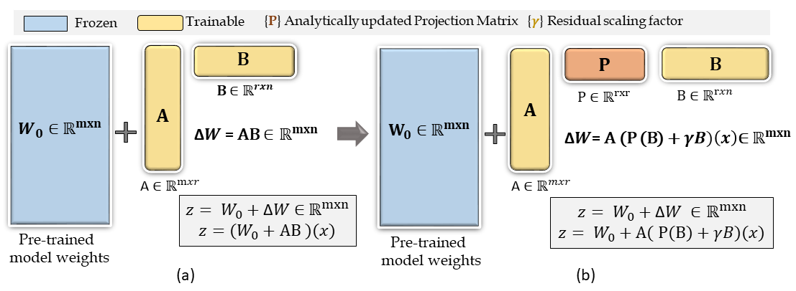
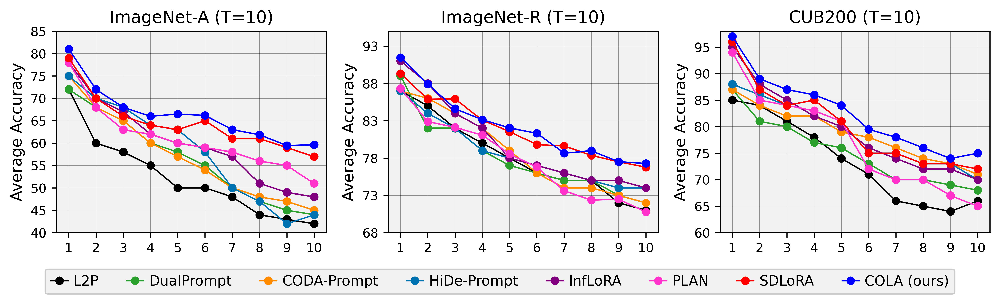
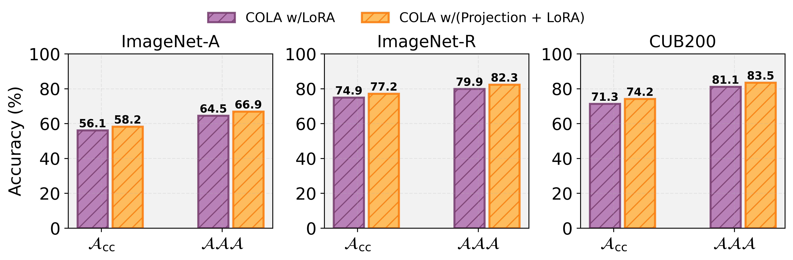

## COLA: Rehearsal-Free Continual Orthogonal Low-Rank Adaptation for CIL
We provide the complete codebase used to benchmark continual learning performance on four popular benchmark datasets for CL.
## Model
 

## Download Datasets
We conduct our experiments on the following datasets:
- ImageNet-A, ImageNet-R, CUB200, DomainNet
- [Download dataset: [Reff-Link](https://github.com/LAMDA-CL/LAMDA-PILOT)]
  
Update dataset path : utils/data.py
 e.g.,
  - train_dir = "./data/imagenet-r/train/" 
  - test_dir = "./data/imagenet-r/test/"

### System Configuration
```
Python 3.12.3
Ubuntu 24.04.1 LTS
CUDA Version: 12.4
```
### Train Model
```
Tested Model: [ViT-B/16, DeiT-L/16, DeiT-S/16]
Tested Datset: [ImageNet-A, ImageNet-R, CUB200, DomainNet]
Mode Type: [direct or woodbury]

======== Run CoLa ================
#python3 main.py --config=./exps/cola_<config-file>

========= Run Baseline ====================
#python3 main.py --config=./exps/<baseline-config-file>

```
## Results
### Performance comparison of COLA against state-of-the-art continual learning methods.
 

### Performance comparison with and without projection matrix.
 

## Acknowledgement 
This work builds upon the [SD-LORA](https://github.com/WuYichen-97/SD-Lora-CL/) and [PILOT](https://github.com/LAMDA-CL/LAMDA-PILOT) repos. We sincerely thank the authors for their contribution.
